-----------
# NeuroWood
-----------
NeuroWood é um software para classificação de qualidade da madeira, voltado à soluções para a indústria madeireira e moveleira. Utiliza técnicas de aprendizado de máquina e visão computacional para classificar imagens do fluxo de processos na madeira em tempo real, permitindo tomada de decisão rápida e automática.

## Instalação

### Pré-Requisitos

#### Python 3

Certifique-se de que o Python versão 3 ou superior está disponível no sistema:
```
python3 --version
```
Se necessário, utilize o gerenciador de pacotes do seu sistema operacional ou obtenha a versão do Python mais recente em <https://www.python.org/downloads/>

#### Bibliotecas Python

Utilize o pip para instalar as dependências:
```
sudo python3 -m pip install numpy scipy sklearn scikit-image
sudo python3 -m pip install https://extras.wxpython.org/wxPython4/extras/linux/gtk3/ubuntu-16.04/wxPython-4.0.0b1-cp36-cp36m-linux_x86_64.whl phoenix gooey
```
Pode ser necessário instalar dependências para o módulo wxPython. Elas podem ser verificadas [aqui](https://github.com/wxWidgets/Phoenix/blob/master/README.rst#prerequisites)

Serão utilizadas seguintes bibliotecas python:

*  numpy 
*  PIL import Image 
*  cv2 
*  pypylon.pylon as py 
*  pickle 
*  h5py 
*  time as tm 
*  os 
*  glob 
*  matplotlib.pyplot as plt 
*  PIL import Image  
*  keras.models import load_model 
*  logging 
*  sys 
*  snap7 
*  snap7 import util 
*  from scipy import signal 
*  from keras import layers 

### Parametros
O programa possue os seguintes parâmetros ajustáveis:


## *Hardware*

O [sistema de visão](Files/prototipo.jpg) indicado na figura a seguir é composto dos seguintes elemenntos:

* Câmera Basler [acA1300-200uc](https://github.com/caffonso/NW/blob/main/Files/acA1300-200uc_Datasheet.pdf) 
* Iluminação [ISO8.1](https://github.com/caffonso/NW/blob/main/Files/ISO-8-1.pdf)
* Módulo de comunição via ethernet [Simens S7 1200](https://cache.industry.siemens.com/dl/files/465/36932465/att_106119/v1/s71200_system_manual_en-US_en-US.pdf)
* Microprocessador intel [Nuc](https://www.intel.com.br/content/dam/www/public/us/en/documents/product-briefs/nuc-kit-nuc7i7bnh-brief.pdf)
* Interface homem-máquina [IHM](https://support.industry.siemens.com/cs/document/109754400/simatic-hmi-option-?dti=0&lc=en-WW) 
* Periféricos: monitor, teclado, mouse.

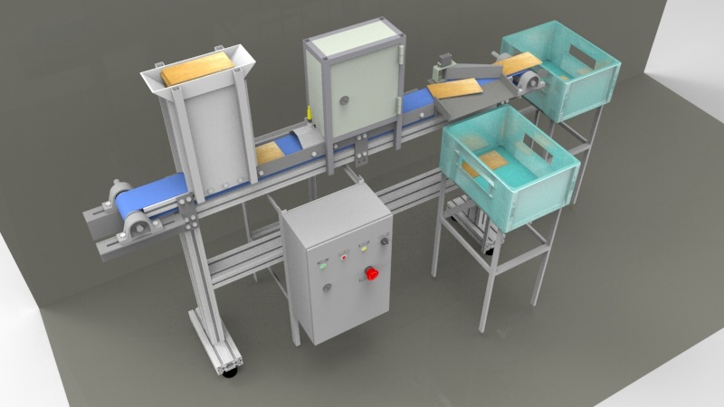

O equipamento de captação de imagens é apresentado a seguir:

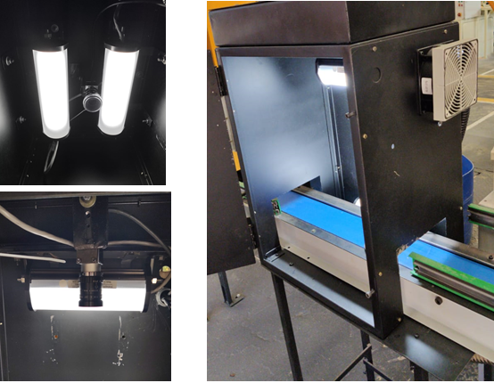

O controle o acionamento dos equipamentos eletricos é controlado pelo IHM, a seguir:


## Montagem 

O processo de montagem deve seguir todas especificações de segurança estabelecidas pelo cliente, especialmente quanto:
- Avaliar os riscos e conseguencias das ações a serem realizadas
- Utilização de EPI's
- Atentar-se quanto as sinalizações: areás de segurança, corredores de pedestres, extintores, etc.
- Acompanhamento dos rsponsaveis pela manutenção do cliente
- Respeitar os horarios e turnos da fábrica.
- Atenção para as normas de cordialidade e respeito no trato das todas as pessoas envolvidas no processo.
- Realizar pausas para café 

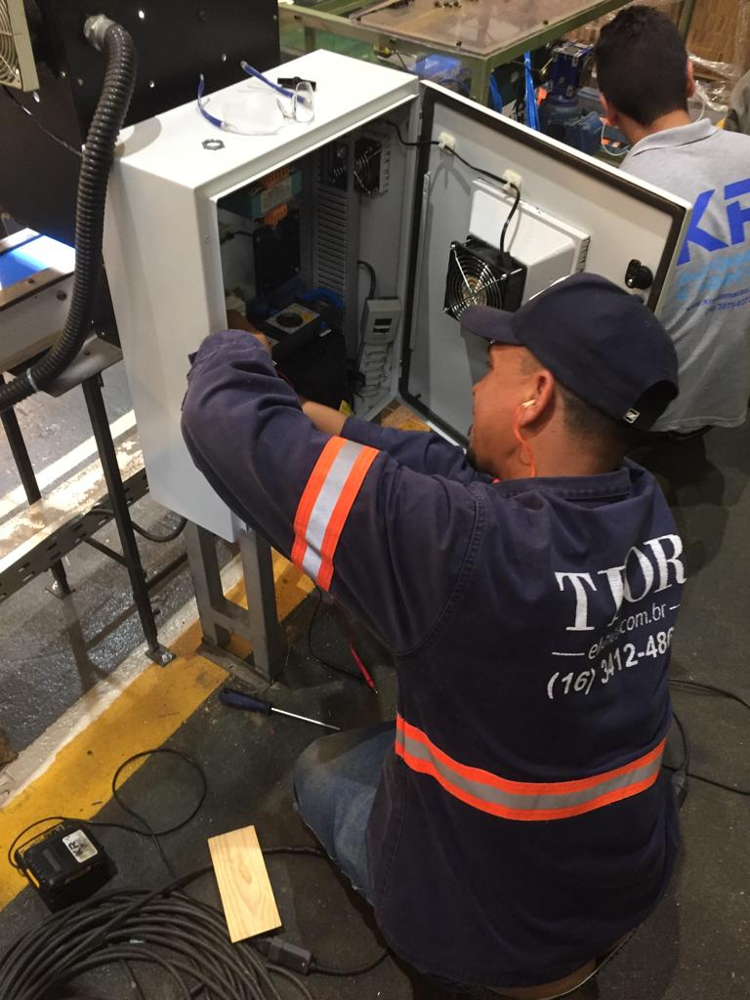

## Garantia e assistência técnica

A garantia de 12 meses após a entrega final do equipamento. A 
garantia se aplica ao software quanto:

I. Funcionamento geral (licenças e versões de software compatíveis);\
II. Captura e qualidade de imagem (caso houver recortes por problemas de trigger, programação e 
etc.);\
III. Quanto a acurácia mínima de 90%, caso a mesma venha a decair conforme o tempo, o fornecedor 
deverá prestar garantia para que esse número seja sempre superior ou igual ao determinado 
nesse memorial descritivo técnico;\
IV. Durante o período de finalização do projeto, a Neurowood treinará três colaboradores do cliente
para que os mesmos possam atuar em momentos de “possíveis falhas”, 
manutenção dos equipamentos e para que esses sejam o primeiro contato com a contratada em 
caso de assistência técnica remota (telefone ou VNC). Os colaboradores que irão receber 
treinamento deverão conter noções de linguagem de programação, análise de sistemas de 
informação e automação elétrica;\
Em caso de não sucesso na assistência técnica remota, a Neurowood deverá se deslocar até a 
Cliente e prestar todo suporte necessário para resolução do problema.

## Sistema classificação. 

O sistema de visão utilizado algoritmos de aprendizagem de máquina, os quais apresentam vantagens operacionais 
em comparaçãao ao métodos analíticos de processamento de imagem, conforme indicado a seguir:

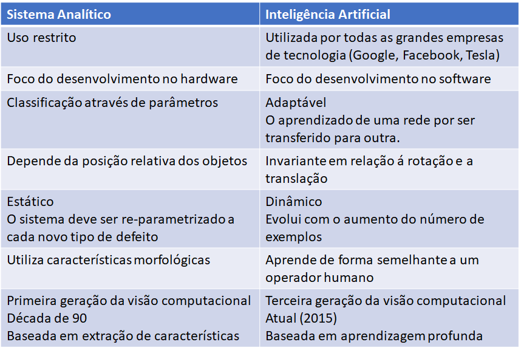

### Melhoramento das imagens.

A fim de utilizar as técnicas de aprendizagem de máquina e redes neurais profundas 
foram aplicadas algumas técnicas de melhoramento de imagens, conforme a seguir:
1. Posicionamento da imagem versus fundo ( background)
2. Normalização quanto ao número de pixels
3. Imagens sintéticas 
4. Eliminação de borrados 
5. Enquadramento 
6. Padronização da intensidade luminosa

### Coleta de imagens e criação de banco de dados

Na inspeção visual automatizada de materiais naturais, em geral, é necessário um grande número de amostras de treinamento, as quais devem ser corretamente rotuladas. Entretanto, obter esse conjunto de dados pode ser um grande desafio para humanos, uma vez que estes são propensos a erros. Adicionalmente, caso a aparência do material mude entre os lotes, será necessário a readaptação dos dados de treinamento ou a nova rotulagem dos anteriores.

O processo da construção do banco de dados se dará em algumas etapas, sendo elas:

* Reconhecimento do local de instalação pela equipe técnica;
* Utilização de material próprio para aquisição de imagens preliminares;
* Treinamento do modelo com imagens preliminares e validação do mesmo;
* Captação de imagens para construção do banco de dados;
* Instalação do produto final de acordo com as especificações;
* Transferência de conhecimento entre o modelo treinado e o equipamento final que será utilizado;
* Validação do modelo final.

Inicialmente é necessário que algumas amostras preliminares sejam coletadas, para isso, algumas imagens de madeira serão capturadas no intuito de desenvolver um banco de dados, utilizando equipamento próprio da equipe técnica, e também de treinar o modelo e consecutivamente valida-lo. Para isso, Será realizado um contato inicial com o cliente para identificar e compreender o processo da linha de produção e as principais dificuldades de sua empresa e, assim, efetuar o estudo das melhores diretrizes para obtenção das imagens e implementação do algoritmo. Posteriormente, são analisados os resultados prelminares e  propostas melhorias, para averiguar se estão de acordo com a necessidade do cliente, demonstrando assim, por meio deste protótipo, os dados promissores e satisfatórios. Ainda nessa etapa inicial 

Uma vez implementada as melhorias e validado os resultados, será necessário realizar a montagem estrutural do equipamento conforme especificado anteriormente. Um próximo passo será a realização da transferência de conhecimento entre o modelo do protótipo para os equipamentos adquiridos, esse processo visa habilitar o equipamento final a tomar as decisões da mesma maneira como foi feita com os dados preliminares validadis. Por fim, será realizado uma validação final do modelo e entrega do produto final já com a parte estrutural e algoritmo implementados capaz de fazer a classificação das materias com base no banco de dados proposto.

Durante a fase de aprendizagem do software, os especialistas do cliente 
deverão fornecer suporte técnico no sentido de rotular a qualidade das tábuas, de
acordo com o posicionamento do defeito. Para tanto será necessário a criação de 
uma base de imagens de aproximadamente 5.000 (mil) amostras de cada tipo de 
classificação.

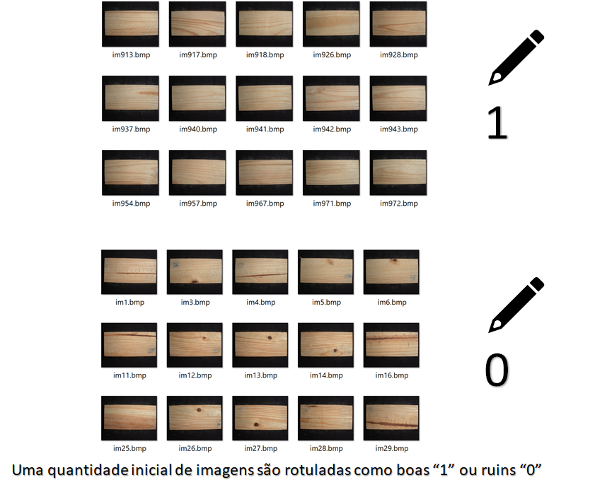

### Como os modelos visualizam as redes.

A o produto madeira é caracterizado por aspectos visuais heterogênios, como nós, veios, diferenças de tonalidade  que são próprios de tecidos vegetais, e portanto,
não podem ser caracterizados como defeitos. O sistema de visão deve, portanto, diferenciar esses padrões vegetais, de outras ocorrências que são efetivamente defeitos.
Os algoritmos de aprendizado de máquina possuem filtros ajustáveis, que possuem a capacidade de se ajustar de forma a identificar somente casos defeituosos conforme
aprsentado a seguir.

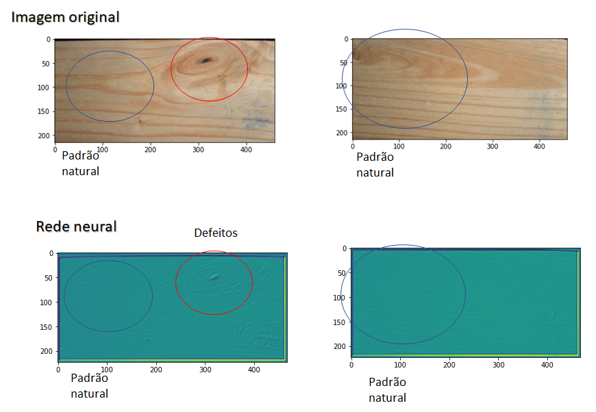

### Padrão de qualidade

As soluções propostas são costumizadas, seguintos os critérios de qualidade especificado pelo cliente, e para cada tipo de produto.

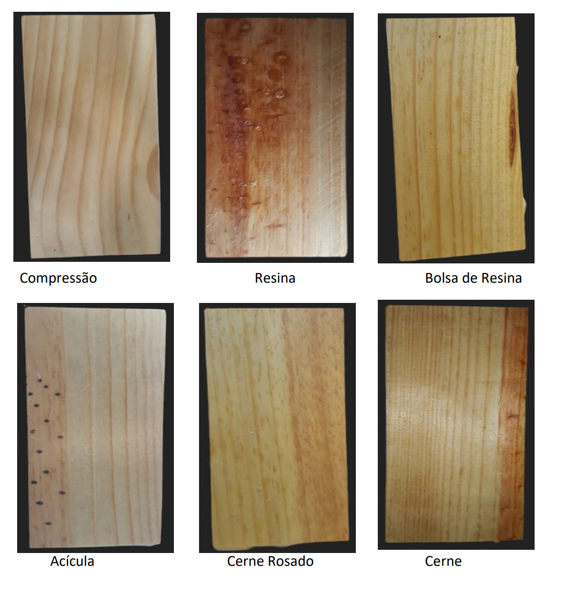

### Rotulação dos dados

Um passo importante nessa etapa é justamente a rotulação de dados, a rotulação de dados está atrelada ao conhecimento das amostras que serão tratadas.
Levanto em consideração aplicação vigente para esse sistema, é necessário que os dados sejam rotulados a fim de entender o que será considerado como sendo bom ou ruim, o que sería uma amostra aceitável ou não. Isso se faz estremamente necessário pois a partir dessas informações será possível treinar o modelo novamente aumentando assim a sua acuracidade.

Não há a necessidade de todas imagens serem rotuladas, isso acaba demorando e diminuindo o desempenho do modelo. Visto isso, uma abordagem inicial é selecionar imagens mais detalhadas com maiores informações possíveis para que essas sim sejam rotuladas. Após esse processo, o algoritmo é capaz de selecionar uma amostra não rotulada e fazer a predição de sua classificação e após esse processo o modelo deve ser treinado novamente no entanto é possível que o modelo sejá mais eficaz mas também é possível que esse novo treinamento seja maléfico. Isso ocorre devido a dificuldade humana de rotulação de dados e levar em consideração todas as caracteristicas naquela imagem. Portanto, visto essa dificuldade humana de rutulação dos dados, utilizando uma quantidade reduzida de dados precisamente rotulados pode ter um grande retorno positivo. 

A rotulação de dados geralmente é feita por equipe especializada, de forma a minimizar as variações de interpretações a respeito de um resultado

## Setup

### Interface com controlador lógico programável CLP

O software de sistema de visão  possui comunicação com o CLP - [Simens S7 1200](https://cache.industry.siemens.com/dl/files/465/36932465/att_106119/v1/s71200_system_manual_en-US_en-US.pdf) em rede ethernet, 
o qual envia e recebe informações na linguagem LADDER. 
O módulos de comunicação via Ethernet deverá aguardar um byte de informação dos processadores de sistema de visão avisando que as câmeras e softwares estão OK para iniciar o processo de “liga da máquina”.
A conecção entre o sistema de visão e o módulo de comunicação via Ethernet será realizado através do *Wrapper* [snap7](https://python-snap7.readthedocs.io/en/latest/). A inicialização do CLP como cliente 
do sistema de visão é realizado pelo método ```OpenPLC()```:

    def OpenPLC(IP,rack,slot):
      plc = snap7.client.Client()
      plc.connect(IP,rack,slot)
      print('PLC siemens:',plc.get_connected())
      return plc  

O sistema de visão envia continuamente um bloco bytearray para o CLP através do método ```Sincronize()```. 


    def Sincronize(Class,plc,DB,start):       
      plc.db_write(DB,start,bytes([Class]))

Os parâmetros internos desse método são:

| nome     | descrição  | valores tipicos |
| :---:    | :---: | :---: |
| plc      | Objeto da classe ``` cliente.Client```               | null        |
| IP       | Endereço do CLP cliente                              |'10.10.0.30' |
| DB       | comprimento do bloco bytearray enviado para CLP      |1            |
| start    | possição inicial para escritá do bloco butearray     |0,1, 2, 3    |
| rack     | número do rack onde CLP está alocado                 |0            |
| slot     | número do slot onde o sistema de visão esta alocado  |1            |
| Class    | Predição do modelo matemático                        |bytearray(0) | 

O sistema de visão envia um bloco de sinal continuamente para o módulos de comunicação via ethernet, quanto este receber o conteudo ```9``` na possição ```start:1```, isto indicará 
que o proximo sinal enviado para a possição ```star:2```será o valor da predição do modelo dado pela variável ```Class```, após esse processo o bloco retorna a possição original.  
```
          Sincronize(7,plc,1,0)       # instante 0
          ...
          Sincronize(9,plc,1,1)       # instante 1
          Sincronize(Class,plc,1,2)   # instante 2
          Sincronize(0,plc,1,3)       # instante 3
          Sincronize(8,plc,1,3)       # instante 4
          Sincronize(0,plc,1,3)       # instante 5
          Sincronize(0,plc,1,1)       # instante 6
          ...
```

Exemplo de ```bloco bytearray```, no instante 2, indicando que o processo esta em andamento ```pos0```= 7, foi detectada um peça ```pos1```= 9, e que a 
previsão do modelo matático é da classe 1, ```pos2``` = 1.

| possiçao     | 0  |  1  |  2  |  3 | 
| :---:        | :---: | :---: | :---: | :---: | 
| conteúdo     |    7  |  9    |   1   |  0    |

### Câmera

A interface entre o *hardware* da câmera Basler [acA1300-200uc](https://github.com/caffonso/NW/blob/main/Files/acA1300-200uc_Datasheet.pdf) 
e a sistema de visão será realizado através do app ```pypylon```.
Para instalação windows:
```
pip3 install pypylon
```

O esquema de iluminação utiliza duas lampadas  ([ISO8.1](https://github.com/caffonso/NW/blob/main/Files/ISO-8-1.pdf)) de 8".
O acesso ao app [pypylon](https://github.com/basler/pypylon), deve ser feito através do prompt através da método ```OpenPylon()```:

```
    def OpenPylon():
      os.system("/opt/pylon5/bin/./PylonViewerApp")
```

Os parâmetros da câmera deve ser ajustado no app neurowood acessando ``<data><action><pylon>``
    


 Aparecera a tela do app da camera onde deve ajustar:
*  Exposure ( default = 800 )
    
### Capitura das imagem

#### Imagens estáticas

Incialmente deve-se ajustar as imagens estáticas, possicionando uma amostra de peca diretamente 
abaixo da câmera e ajustar os recortes através do método ```OpenImage()```. 
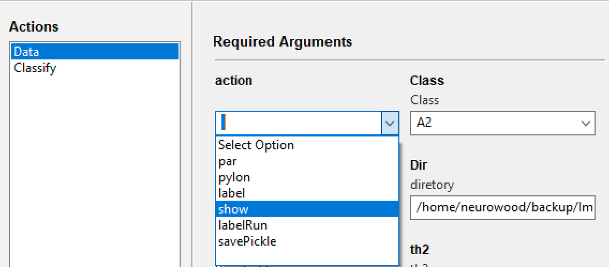


Os disturbios devem ser verificados eliminados, a fim de garantir a
uma boa captação de imagens:

* *over light*
* sugidades ou corpos estranhos
* imagem fora de foco

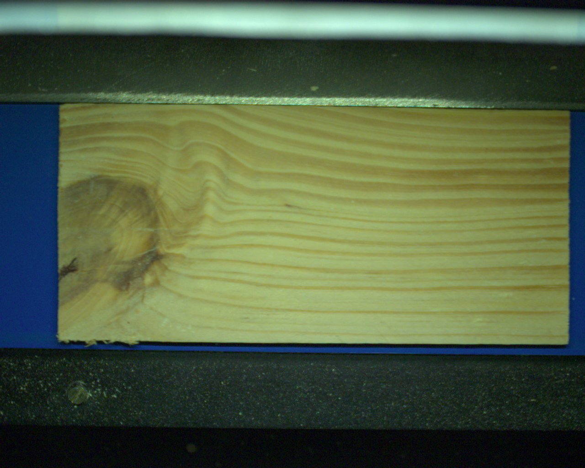 

Nesta etápa são ajustadas as imagens em condição de operação portanto, deve-se certificar que a esteira de movimentaçõ deve estar operando
em velocidade de produção. 
Acionar o metodoo ``` Enhancement```, conforme ilustração a seguir:

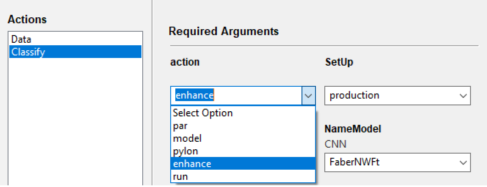

Os parâmetros a seguir devem ser acessados até que o recorte da imagem esteja adquado:```rx,ry,xc,yc,th```


A fim de ajuste as pecas devem ser liberadas manualmente e em pequena quantidade, até que a captura das imagens
esteja totalmente ajustada, conforme imagem abaixo. Estas operações sáo realizadas pelos métodos, ```wall()``` e ```enhance()```

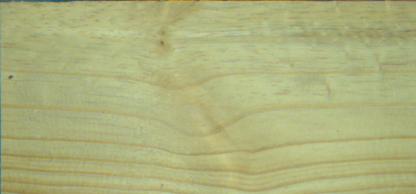 

#### Imagens dinâmicas

Com a esteira de alimentação operando na velocidade de processo, a classificação é realizada pelo método ```setup```.

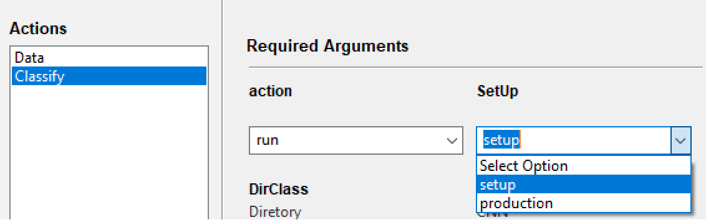 

## Inicio da produção

### Seleção do modelo

Os sistemas de visão são desenvolvidos para solução customizados de acordo com padrões
de qualidade definidos pelo cliente.
Cada modelo matemático representa uma aplicação especifica, o qual pode ser definido através da interface:

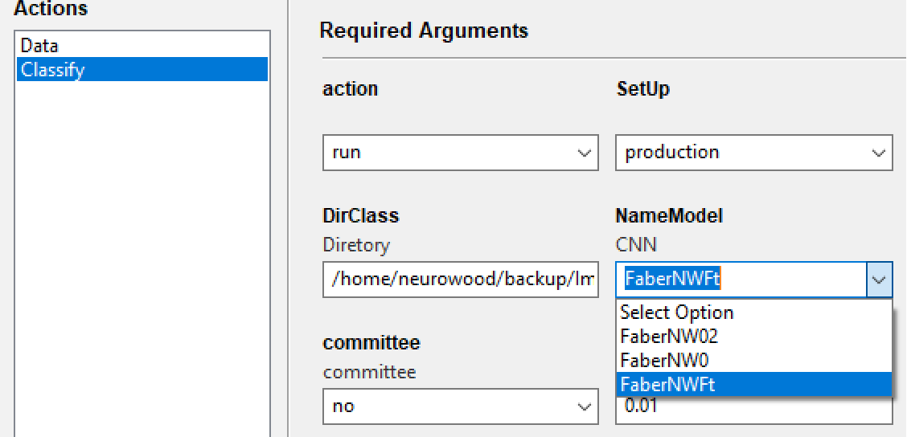

### Otimizadora

O equipamento pode ser utilizado também para o processo de otimização de corte de ripas. Selecionando
as possições que devem ser serradas. Aumentando desta forma o rendimento do corte. 

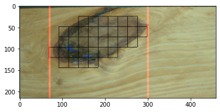

Um dos lideres do mercado de otimizadoras é a empresa [Weinig](Files/WEINIG.pdf), composta por uma [Serra automatizada](Files/Weinig_saw.pdf)
e por um scanner. 


## Documentação e obrigações

* Try-Out de Aprovação do Equipamento de no mínimo uma semana e até que atinja a 
necessidade descrita nesse caderno de especificação, junto à equipe de Engenharia 
Mecânica/Elétrica/Processo.
* Start-Up do equipamento junto à contratada, que deverá ser de no mínimo uma semana, 
junto à equipe de processo. 
* Entrega de toda documentação (Esquema Elétrico, Lista de Material, Lista de Material de 
Reposição (Spare Parts), Desenho de Layout do Painel Elétrico revisado em dwg, pdf e 01 
cópia impressa em papel).
* Entrega do Programa do CLP elaborada no software de programação Tia Porta Versão 13 
em
* Ladder e com comentários;
* ART assinada pelo Engenheiro Responsável e a mesma deve estar descrito conforme 
NBR-12100 (fornecedor);
* Todo projeto mecânico/elétrico (Esquemas, layout de painel, lista de material, etc.) 
deverá ser aprovado pela Equipe de Engenharia Mecânica/Elétrica/Processo do cliente antes da construção do equipamento.
* Todos os serviços elétricos realizados dentro do cliente, deverão seguir os as 
normas aplicáveis.
* Todos os profissionais deverão possuir obrigatoriamente o curso de NR-10, deverão 
seguir os procedimentos e estarem habilitados, qualificados e capacitados, conforme 
determinam as normas.
* O serviço só poderá ser executado dentro do cliente com acompanhamento de um Colaborador  habilitado, qualificado e autorizado pela NR-10.
* Todos os funcionários Terceiros devem cumprir o procedimento interno cliente.
* Todo serviço realizado em altura deverá ser feito por uma pessoa habilitada pela Norma 
NR-35

    
## Resolução de problemas.

A FMEA (Feal moded effect analysis) foi utilizada para verificar as potenciais falhas de processo. Para isso, é importante primeiramente identificar as possíveis causas e efeitos dessas falhas. De acordo com cada modo de falha é necessário definir a severidade, ocorrência e detecção.

* Severidade da falha (IS): classificação que deve considerar questões importantes para a empresa e seus clientes como a segurança do cliente e a proteção ao meio ambiente. 
* Ocorrência da falha (IO): indica a probabilidade da falha ocorrer. 
* Detecção da falha (ID): classificação que mostra a probabilidade do problema ser detectado antes da ocorrência.

Após essa análise, multiplicamos os três números obtidos para encontrar o índice de risco (NPR), quanto maior for o resultado deste índice, mais crítica será aquela falha. O que significa que uma medida de ação corretiva deve ser tomada o quanto antes para evitar maiores problemas. Sendo assim temos as seguintes faixas para o NPR:


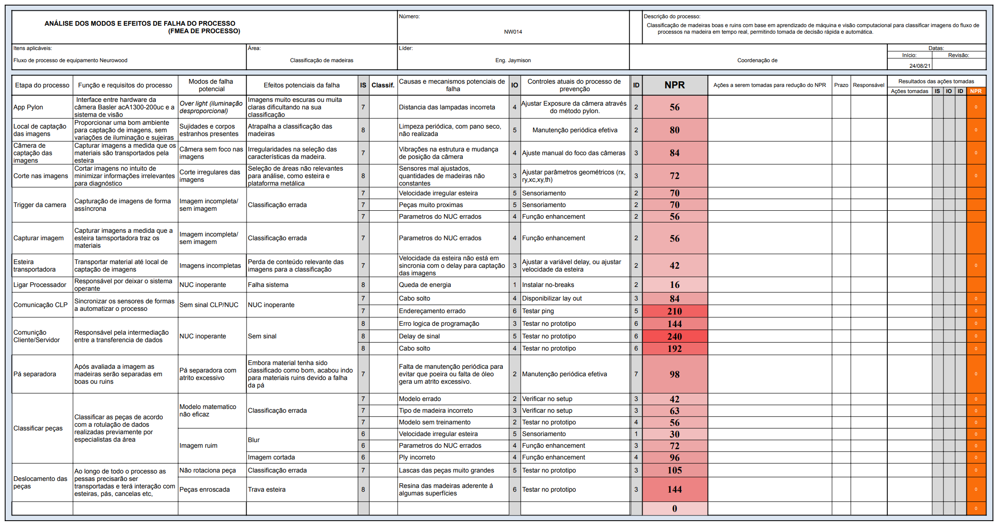

  
