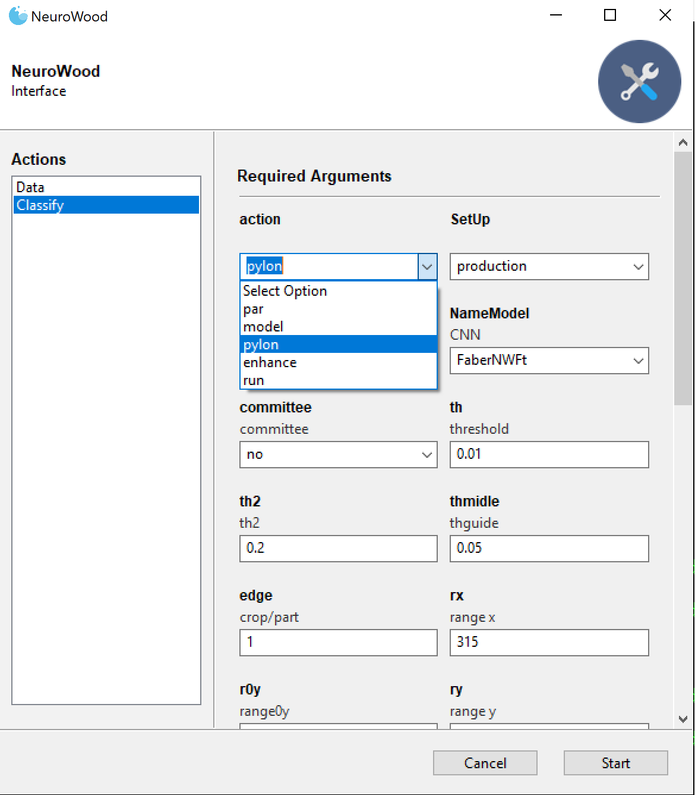

-----------
# NeuroWood
-----------
NeuroWood é um software para classificação de qualidade da madeira, voltado à soluções para a indústria madeireira e moveleira. Utiliza técnicas de aprendizado de máquina e visão computacional para classificar imagens do fluxo de processos na madeira em tempo real, permitindo tomada de decisão rápida e automática.

## Instalação

### Pré-Requisitos

#### Python 3

Certifique-se de que o Python versão 3 ou superior está disponível no sistema:
```
python3 --version
```
Se necessário, utilize o gerenciador de pacotes do seu sistema operacional ou obtenha a versão do Python mais recente em <https://www.python.org/downloads/>

#### Bibliotecas Python

Utilize o pip para instalar as dependências:
```
sudo python3 -m pip install numpy scipy sklearn scikit-image
sudo python3 -m pip install https://extras.wxpython.org/wxPython4/extras/linux/gtk3/ubuntu-16.04/wxPython-4.0.0b1-cp36-cp36m-linux_x86_64.whl phoenix gooey
```
Pode ser necessário instalar dependências para o módulo wxPython. Elas podem ser verificadas [aqui](https://github.com/wxWidgets/Phoenix/blob/master/README.rst#prerequisites)

Serão utilizadas seguintes bibliotecas python:

*  numpy 
*  PIL import Image 
*  cv2 
*  pypylon.pylon as py 
*  pickle 
*  h5py 
*  time as tm 
*  os 
*  glob 
*  matplotlib.pyplot as plt 
*  PIL import Image  
*  keras.models import load_model 
*  logging 
*  sys 
*  snap7 
*  snap7 import util 
*  from scipy import signal 
*  from keras import layers 

### Parametros
O programa possue os seguintes parâmetros ajustáveis:


## *Hardware*

O [sistema de visão](Files/prototipo.jpg) indicado na figura a seguir é composto dos seguintes elemenntos:

* Câmera Basler [acA1300-200uc](https://github.com/caffonso/NW/blob/main/Files/acA1300-200uc_Datasheet.pdf) 
* Iluminação [ISO8.1](https://github.com/caffonso/NW/blob/main/Files/ISO-8-1.pdf)
* Módulo de comunição via ethernet [Simens S7 1200](https://cache.industry.siemens.com/dl/files/465/36932465/att_106119/v1/s71200_system_manual_en-US_en-US.pdf)
* Microprocessador intel [Nuc](https://www.intel.com.br/content/dam/www/public/us/en/documents/product-briefs/nuc-kit-nuc7i7bnh-brief.pdf)
* Periféricos: monitor, teclado, mause.


O equipamento de captação de imagens é apresentado a seguir:


## Garantia e assistência técnica

A garantia de 12 meses após a entrega final do equipamento. A 
garantia se aplica ao software quanto:

I. Funcionamento geral (licenças e versões de software compatíveis);\
II. Captura e qualidade de imagem (caso houver recortes por problemas de trigger, programação e 
etc.);\
III. Quanto a acurácia mínima de 90%, caso a mesma venha a decair conforme o tempo, o fornecedor 
deverá prestar garantia para que esse número seja sempre superior ou igual ao determinado 
nesse memorial descritivo técnico;\
IV. Durante o período de finalização do projeto, a Neurowood treinará três colaboradores do cliente
para que os mesmos possam atuar em momentos de “possíveis falhas”, 
manutenção dos equipamentos e para que esses sejam o primeiro contato com a contratada em 
caso de assistência técnica remota (telefone ou VNC). Os colaboradores que irão receber 
treinamento deverão conter noções de linguagem de programação, análise de sistemas de 
informação e automação elétrica;\
Em caso de não sucesso na assistência técnica remota, a Neurowood deverá se deslocar até a 
Cliente e prestar todo suporte necessário para resolução do problema.
## Setup

### Interface com controlador lógico programável CLP

O software de sistema de visão  possui comunicação com o CLP - [Simens S7 1200](https://cache.industry.siemens.com/dl/files/465/36932465/att_106119/v1/s71200_system_manual_en-US_en-US.pdf) em rede ethernet, 
o qual envia e recebe informações na linguagem LADDER. 
O módulos de comunicação via Ethernet deverá aguardar um byte de informação dos processadores de sistema de visão avisando que as câmeras e softwares estão OK para iniciar o processo de “liga da máquina”.
A conecção entre o sistema de visão e o módulo de comunicação via Ethernet será realizado através do *Wrapper* [snap7](https://python-snap7.readthedocs.io/en/latest/). A inicialização do CLP como cliente 
do sistema de visão é realizado pelo método ```OpenPLC()```:

    def OpenPLC(IP,rack,slot):
      plc = snap7.client.Client()
      plc.connect(IP,rack,slot)
      print('PLC siemens:',plc.get_connected())
      return plc  

O sistema de visão envia continuamente um bloco bytearray para o CLP através do método ```Sincronize()```. 


    def Sincronize(Class,plc,DB,start):       
      plc.db_write(DB,start,bytes([Class]))

Os parâmetros internos desse método são:

| nome     | descrição  | valores tipicos |
| :---:    | :---: | :---: |
| plc      | Objeto da classe ``` cliente.Client```               | null        |
| IP       | Endereço do CLP cliente                              |'10.10.0.30' |
| DB       | comprimento do bloco bytearray enviado para CLP      |1            |
| start    | possição inicial para escritá do bloco butearray     |0,1, 2, 3    |
| rack     | número do rack onde CLP está alocado                 |0            |
| slot     | número do slot onde o sistema de visão esta alocado  |1            |
| Class    | Predição do modelo matemático                        |bytearray(0) | 

O sistema de visão envia um bloco de sinal continuamente para o módulos de comunicação via ethernet, quanto este receber o conteudo ```9``` na possição ```start:1```, isto indicará 
que o proximo sinal enviado para a possição ```star:2```será o valor da predição do modelo dado pela variável ```Class```, após esse processo o bloco retorna a possição original.  
```
          Sincronize(7,plc,1,0)       # instante 0
          ...
          Sincronize(9,plc,1,1)       # instante 1
          Sincronize(Class,plc,1,2)   # instante 2
          Sincronize(0,plc,1,3)       # instante 3
          Sincronize(8,plc,1,3)       # instante 4
          Sincronize(0,plc,1,3)       # instante 5
          Sincronize(0,plc,1,1)       # instante 6
          ...
```

Exemplo de ```bloco bytearray```, no instante 2, indicando que o processo esta em andamento ```pos0```= 7, foi detectada um peça ```pos1```= 9, e que a 
previsão do modelo matático é da classe 1, ```pos2``` = 1.

| possiçao     | 0  |  1  |  2  |  3 | 
| :---:        | :---: | :---: | :---: | :---: | 
| conteúdo     |    7  |  9    |   1   |  0    |

### Câmera

A interface entre o *hardware* da câmera Basler [acA1300-200uc](https://github.com/caffonso/NW/blob/main/Files/acA1300-200uc_Datasheet.pdf) 
e a sistema de visão será realizado através do app ```pypylon```.
Para instalação windows:
```
pip3 install pypylon
```

O esquema de iluminação utiliza duas lampadas  ([ISO8.1](https://github.com/caffonso/NW/blob/main/Files/ISO-8-1.pdf)) de 8".
O acesso ao app [pypylon](https://github.com/basler/pypylon), deve ser feito através do prompt através da método ```OpenPylon()```:

```
    def OpenPylon():
      os.system("/opt/pylon5/bin/./PylonViewerApp")
```

Os parâmetros da câmera deve ser ajustado no app neurowood acessando ``<data><action><pylon>``
    



 Aparecera a tela do app da camera onde deve ajustar:
*  Exposure ( default = 800 )
    
### Capitura das imagem

#### Imagens estáticas

Incialmente deve-se ajustar as imagens estáticas, possicionando uma amostra de peca diretamente 
abaixo da câmera e ajustar os recortes através do método ```OpenImage()```. 


Os disturbios devem ser verificados eliminados, a fim de garantir a
uma boa captação de imagens:

* *over light*
* sugidades ou corpos estranhos
* imagem fora de foco

 

Nesta etápa são ajustadas as imagens em condição de operação portanto, deve-se certificar que a esteira de movimentaçõ deve estar operando
em velocidade de produção. 
Acionar o metodoo ``` Enhancement```, conforme ilustração a seguir:


Os parâmetros a seguir devem ser acessados até que o recorte da imagem esteja adquado:```rx,ry,xc,yc,th```


A fim de ajuste as pecas devem ser liberadas manualmente e em pequena quantidade, até que a captura das imagens
esteja totalmente ajustada, conforme imagem abaixo. Estas operações sáo realizadas pelos métodos, ```wall()``` e ```enhance()```

 

### Imagens dinâmicas

Com a esteira de alimentação operando na velocidade de processo, a classificação é realizada pelo método ```setup```.

 


## Inicio da produção

### Seleção do modelo

Os sistemas de visão são desenvolvidos para solução customizados de acordo com padrões
de qualidade definidos pelo cliente.
Cada modelo matemático representa um aplicação especifico, o qual pode ser definido através da interface:


    
### Resolução de problemas.
    
| problema     | ação  | 
| :---:        | :---: | 
| *over light*                                           | Ajustar *Exposure* da camerâ através do método `pylon`.       |
|sugidades ou corpos estranhos                           | Limpar área utilizando um pano seco                           |    
|imagem fora de foco                                     | Ajuste manual do foco nas lentes                              | 
|Corte (cropp) irregular, sobre ou falta peça            | Ajustar parâmetros geometricos ```(rx,ry,xc,xy,th) ```        | 
|Imagem incompleta or cortada                            | Ajustar variável ```delay```                                  | 

 
